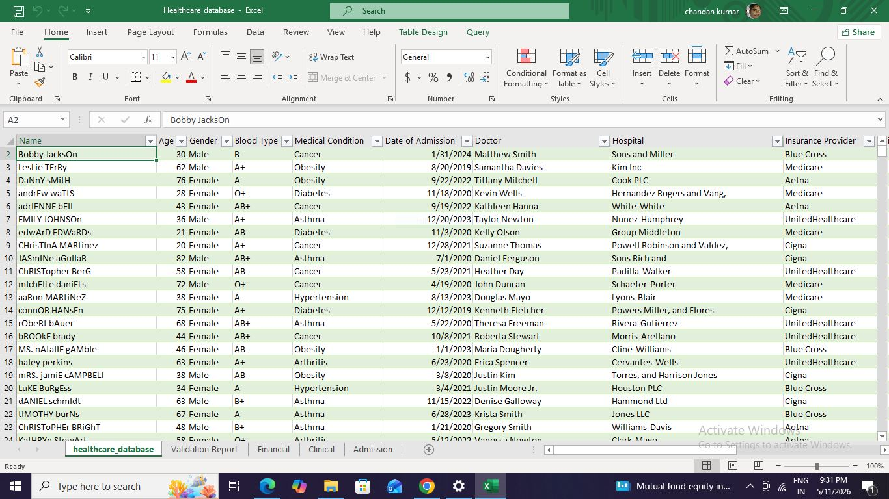
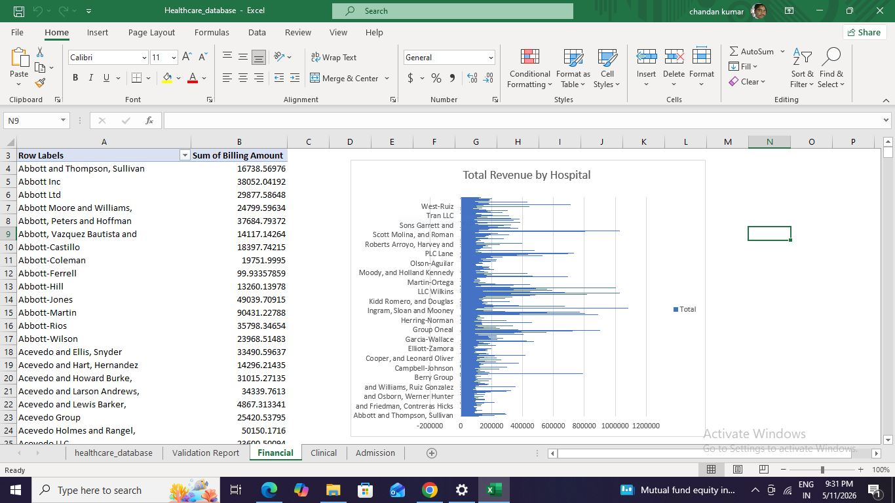

# Healthcare-Database
This project focuses on analyzing healthcare data to monitor patient health trends and hospital financial performance. By leveraging Advanced Excel and Power Query, the system automates the tracking of critical KPIs, such as patient volume by medical condition and billing efficiency across different hospital departments.
# 1. Overall Healthcre Database 
# 2. Total Revenue by Hospital 
